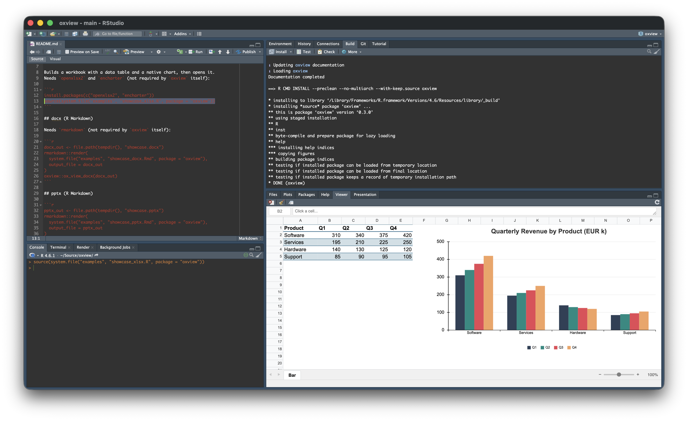
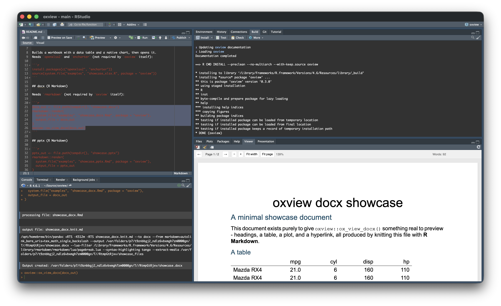
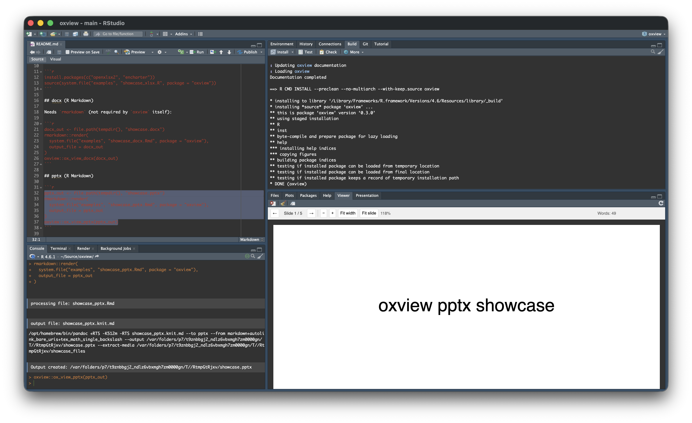

<!-- README.md is generated from README.Rmd. Please edit that file -->

# oxview

`oxview` is an R package that bundles the
[office-open-xml-viewer](https://github.com/yukiyokotani/office-open-xml-viewer)
to provide preview functionality for `.docx`, `.pptx`, and `.xlsx` files
directly within the RStudio Viewer pane.

## Installation

You can install the development version of `oxview` from
[GitHub](https://github.com/) with:

``` r
# install.packages("remotes")
remotes::install_github("JanMarvin/oxview")
```

## Usage

``` r
if (interactive()) {
  oxview::ox_view(x = "https://github.com/JanMarvin/msoc/raw/refs/heads/main/inst/extdata/Untitled1.docx")
  oxview::ox_view(x = "https://github.com/JanMarvin/msoc/raw/refs/heads/main/inst/extdata/Untitled1.pptx")
  oxview::ox_view(x = "https://github.com/JanMarvin/msoc/raw/refs/heads/main/inst/extdata/Untitled1.xlsx")
}
```

## Screenshots

<!-- Drafts - swap these for real screenshots of each viewer. -->

### xlsx

<figure>

<figcaption aria-hidden="true">xlsx viewer screenshot
placeholder</figcaption>
</figure>

### docx

<figure>

<figcaption aria-hidden="true">docx viewer screenshot
placeholder</figcaption>
</figure>

### pptx

<figure>

<figcaption aria-hidden="true">pptx viewer screenshot
placeholder</figcaption>
</figure>

## License

This package is licensed under the MIT license and is based on
[`office-open-xml-viewer`](https://github.com/yukiyokotani/office-open-xml-viewer)
(by Yuki Yokotani; COPYRIGHT 2026) released under the MIT license.
